# Motivation & Setup

## The Information Channel Is a Trap

\begin{center}
\large
The same channel that helps citizens coordinate\\
is the channel regimes can \textbf{poison}.
\end{center}

\vspace{1em}

**Three hard problems in global games:**

1. Lab experiments $\rightarrow$ stylized numeric settings, small $n$
2. Field data $\rightarrow$ confounded by institutions, unobserved information
3. Theory $\rightarrow$ tractable but hard to test at scale

\vspace{0.5em}

**This paper:** Embed LLM agents in Morris--Shin (2003) regime-change game

- Private signals conveyed as \textbf{natural-language intelligence briefings}
- Pre-play communication on a network
- Surveillance, censorship, and information design treatments

## This Talk

\begin{enumerate}
\item \textbf{Theory} --- Global game of regime change (5 min)
\item \textbf{Design} --- Signal $\to$ text $\to$ decision pipeline (10 min)
\item \textbf{Part I: Benchmark} --- Do LLMs play threshold strategies? (10 min)
\item \textbf{Part II: Information Design} --- Censorship \& persuasion (10 min)
\item \textbf{Part III: Surveillance} --- The central result (15 min)
\item \textbf{Discussion} (10 min)
\end{enumerate}

# Theory

## The Global Game of Regime Change

Citizens $i \in [0,1]$ choose: **JOIN** uprising ($a_i = 1$) or **STAY** home ($a_i = 0$)

\vspace{0.5em}

- Regime strength $\theta \sim$ diffuse prior
- Regime falls $\iff A \equiv \int a_i \, di > \theta$

\vspace{0.5em}

**Payoffs:**
$$u_i = \begin{cases} B & \text{join \& regime falls} \\ -C & \text{join \& regime survives} \\ 0 & \text{stay} \end{cases}$$

Private signals: $x_i = \theta + \varepsilon_i$, \quad $\varepsilon_i \sim \mathcal{N}(0, \sigma^2)$

## Equilibrium (Morris & Shin 2003)

**Unique BNE in threshold strategies:**

$$\text{Join} \iff x_i < x^* = \theta^* + \sigma\Phi^{-1}(\theta^*)$$

where $\theta^* = \frac{B}{B+C}$

\vspace{1em}

**Attack mass** --- theoretical join fraction at regime strength $\theta$:

$$A(\theta) = \Phi\!\left(\frac{x^* - \theta}{\sigma}\right)$$

\vspace{0.5em}

$\Rightarrow$ Decreasing sigmoid in $\theta$: weaker regimes face larger uprisings

\vspace{0.5em}

**Empirical question:** Do LLM agents approximate this?

## Why LLMs?

**What LLMs offer over lab experiments:**

- Rich natural-language information environment (not just numbers)
- Scale: 7 models $\times$ 1,800 country--periods $\times$ 25 agents
- Full control over the information structure
- Identical prompt structure across models
- Replicable, cached, reproducible

\vspace{1em}

**What LLMs do \textit{not} offer:**

- Claims about human behavior
- Proof of ``rational'' reasoning
- The behavioral regularity is the \textit{platform}, not the claim

# Experimental Design

## The Pipeline: Signal $\to$ Text $\to$ Decision

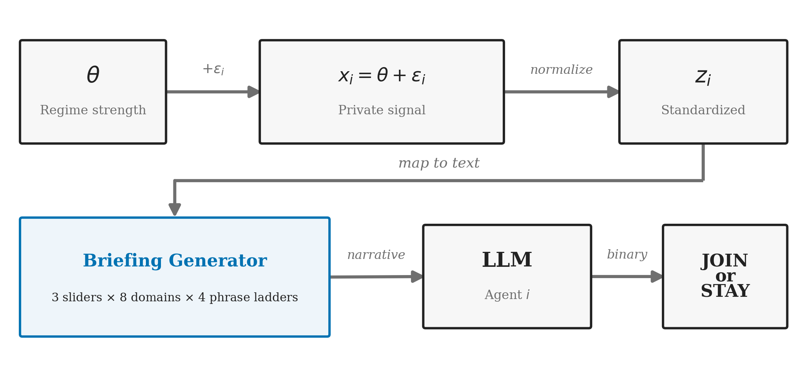{width=95%}

\vspace{0.5em}

\small
$\theta \to x_i = \theta + \varepsilon_i \to z_i = (x_i - \bar{z})/\sigma \to$ \textbf{briefing generator} $\to$ LLM call $\to$ JOIN/STAY

## The Briefing Generator

**Core idea:** Convert continuous z-scores into graded natural language

\vspace{0.5em}

Three latent sliders control phrase selection across **8 evidence domains**:

| Slider | Function | Effect |
|--------|----------|--------|
| Direction | $\Lambda(0.8z)$ (logistic) | Pro-uprising vs. pro-regime tone |
| Clarity | $1 - e^{-(z/1.0)^2}$ (U-shaped) | Ambiguous near cutoff, clear at extremes |
| Coordination | $\Lambda(-0.6z)$ (decreasing) | Open coordination climate vs. suppressed |

\vspace{0.5em}

**Domains:** Elite cohesion, security posture, economic fundamentals, institutional resilience, public coordination, dissent signals, international stance, media environment

## Example Briefings

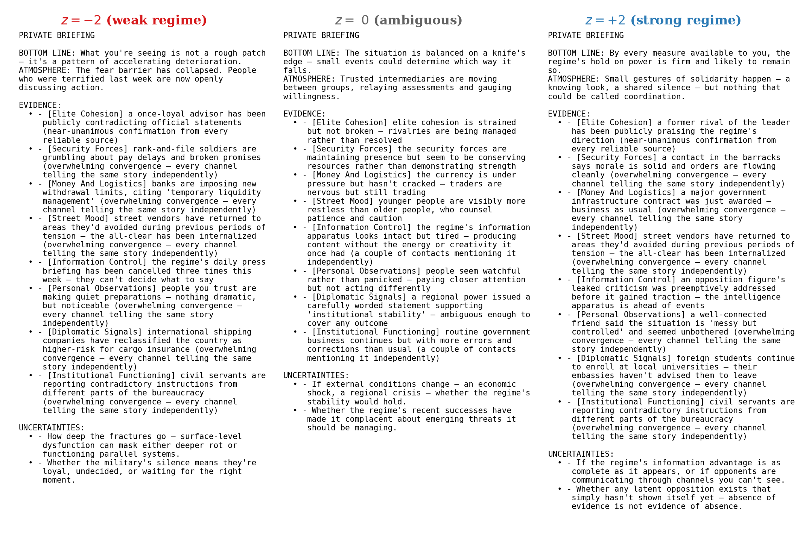{width=95%}

\footnotesize
\textit{Left:} $z = -2$ (strong join signal). \textit{Center:} $z = 0$ (ambiguous). \textit{Right:} $z = +2$ (strong stay signal).

## Experimental Structure

| Part | $\theta$ distribution | Baseline | Question |
|------|----------------------|----------|----------|
| I (Benchmark) | $\mathcal{N}(\bar{z}, 1)$ | Pure game | Threshold behavior? |
| II (Info Design) | Grid $[0.2, 0.8]$ | Calibrated | Can we shift coordination? |
| III (Surveillance) | Same as I | Comm game | Can regimes exploit comms? |

\vspace{1em}

**Seven models** spanning six architecture families:

- Mistral Small Creative (primary), Llama 3.3 70B, Qwen3 30B/235B
- GPT-4o-mini-OSS, Trinity Large, MiniMax-M1

\vspace{0.5em}

All: $n = 25$ agents, $\sigma = 0.3$, temperature $= 0.7$, via OpenRouter

## Calibration

**One-degree-of-freedom calibration:**

- Only adjust `cutoff_center` (shifts the z-score origin)
- Sigmoid **slope is emergent**, never optimized
- Iterative damped gradient until fitted logistic center $\approx 0$

\vspace{1em}

**Key validation:**

- Holdout validation confirms no overfitting
- 6 uncalibrated models still produce $|r| > 0.71$
- Deliberately miscalibrating ($\pm 0.3$ shift) leaves $r$ unchanged
- $\Rightarrow$ Calibration adjusts the \textit{level}, not the \textit{slope}

# Part I: Behavioral Benchmark

## Result 1: Threshold-Policy Alignment

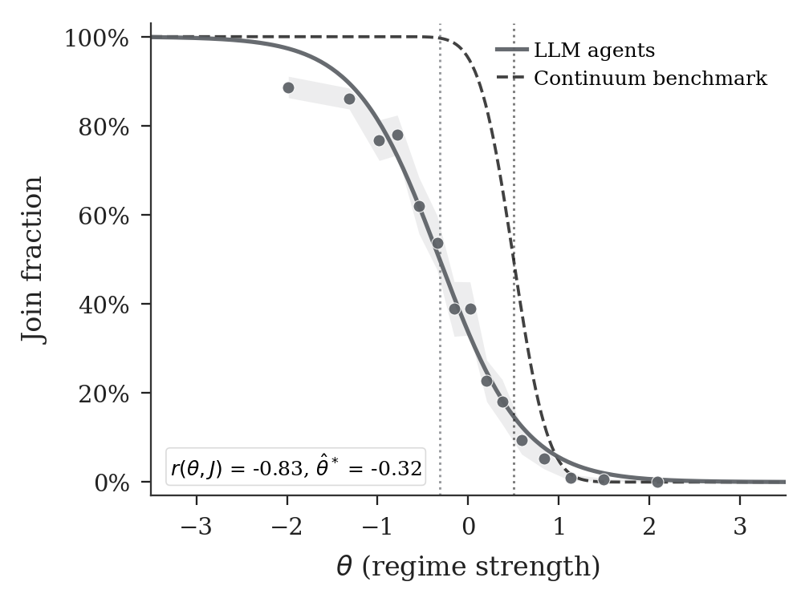{width=80%}

\vspace{0.3em}

\small
Mistral, 1,000 periods. Empirical sigmoid left-shifted ($\hat{\theta}^* = -0.32$) vs. theory ($\theta^* = 0.50$). Mean $r(J, A(\theta)) = +0.80$ across 7 models, $p < 0.001$ for every model.

## Cross-Model Replication

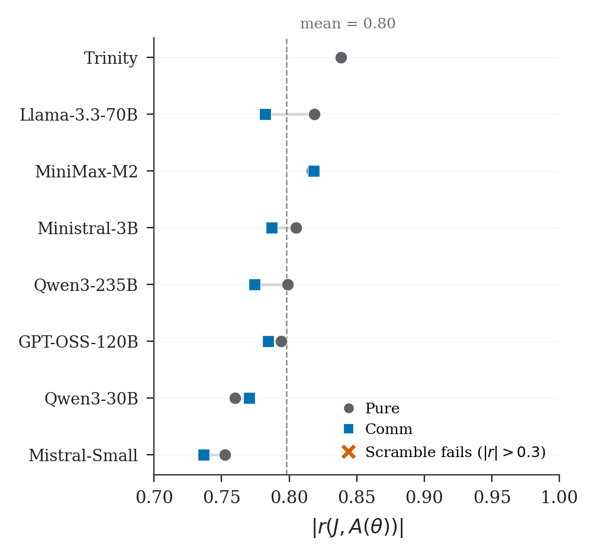{width=80%}

\vspace{0.3em}

\small
$r \in [+0.75, +0.84]$ despite parameter counts spanning an order of magnitude. Correlation is robust; intercepts vary (model-specific action biases).

## The Falsification Triptych

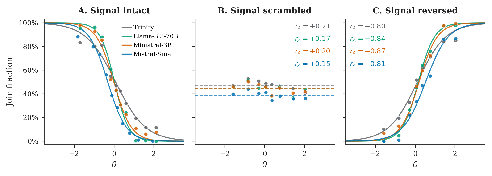{width=95%}

\vspace{0.3em}

\small
\textbf{Pure:} $r = +0.80$. \textbf{Scramble} (permute briefings across periods): $r = +0.03$. \textbf{Flip} (negate z-scores): $r = -0.80$. All replicate across 7 models.

## Why Not Just Text Classification?

Three identification strategies beyond the sigmoid:

\vspace{0.5em}

**1. Narrative stakes ladder** (fixed briefing body, vary header only):

- 8 conditions from ``existential consequences'' to ``zero cost''
- Mean joining: 21\% $\to$ 79\% (57.6 pp range)
- Placebo (weather) = 33\% --- irrelevant context dilutes signal
- Text classifier sees only briefing body $\Rightarrow$ cannot explain the shift

\vspace{0.5em}

**2. Payoff sweep** ($B/C$ ratio varies $\theta^*$):

- 7 conditions, fitted cutoffs track $\theta^*$ with $r = 0.997$
- Pipeline centering diagnostic, not payoff-reasoning proof

\vspace{0.5em}

**3. BNE vs. Level-$k$:**

- BNE fits better (RMSE = 0.199) than $L_1$ (0.307) or $L_2$ (0.348)
- But: centering diagnostic, not clean $L_k$ rejection

## Narrative Stakes Ladder

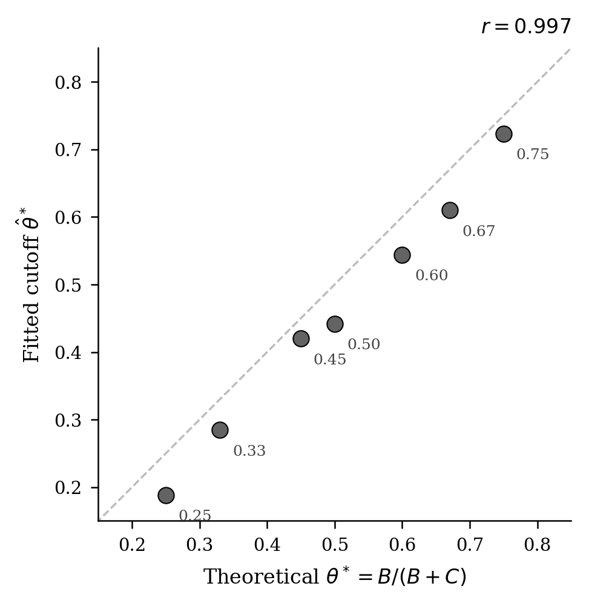{width=85%}

\footnotesize
\textit{Left:} Fitted cutoff $\hat{\theta}^*$ tracks theoretical $\theta^*$ ($r = 0.997$). \textit{Right:} Narrative cost ladder --- monotonic dose-response, paraphrase robustness, placebo control.

## Communication Creates an Informative Channel

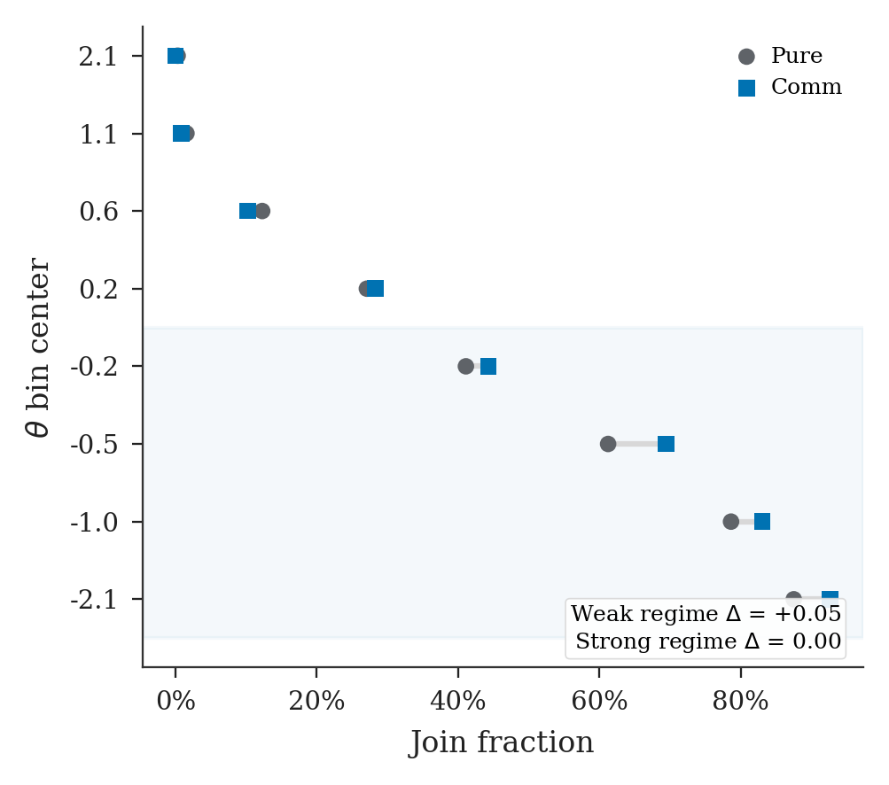{width=80%}

\vspace{0.3em}

\small

- Pre-play messaging on Watts--Strogatz network ($k=4$, $p=0.3$)
- Matched-cell comparison: $\Delta = +2.1$ pp ($t = 6.38$, $p < 0.001$)
- Messages carry real information: $R^2(\theta \mid \text{messages}) = 0.12$
- Signal structure preserved ($r = +0.78$)

\vspace{0.3em}

\textbf{Key:} The channel is \textit{informative}. This is what makes it exploitable.

# Part II: Information Design

## Information Design Framework

**Bayesian persuasion** (Kamenica \& Gentzkow 2011; Goldstein \& Huang 2016):

\vspace{0.5em}

The designer controls $\pi: \Theta \to \Delta(\mathcal{S})$ --- the mapping from states to signal distributions

\vspace{0.5em}

**Implementation:** Modify the briefing generator's slider functions near $\theta^*$

$$w(\theta) = \exp\!\left(-\left(\frac{\theta - \theta^*}{h}\right)^2\right)$$

\vspace{0.5em}

| Design | Manipulation | Prediction |
|--------|-------------|------------|
| Stability | Widen clarity kernel | Suppress joining |
| Instability | Sharpen signals | Raise joining |
| Upper censorship | Pool $\theta \leq \theta^*$ to neutral | Suppress joining |
| Lower censorship | Pool $\theta \geq \theta^*$ to neutral | Attenuate slope |
| Public signal | Add shared observations | Crowd out private info |

## All Information Designs

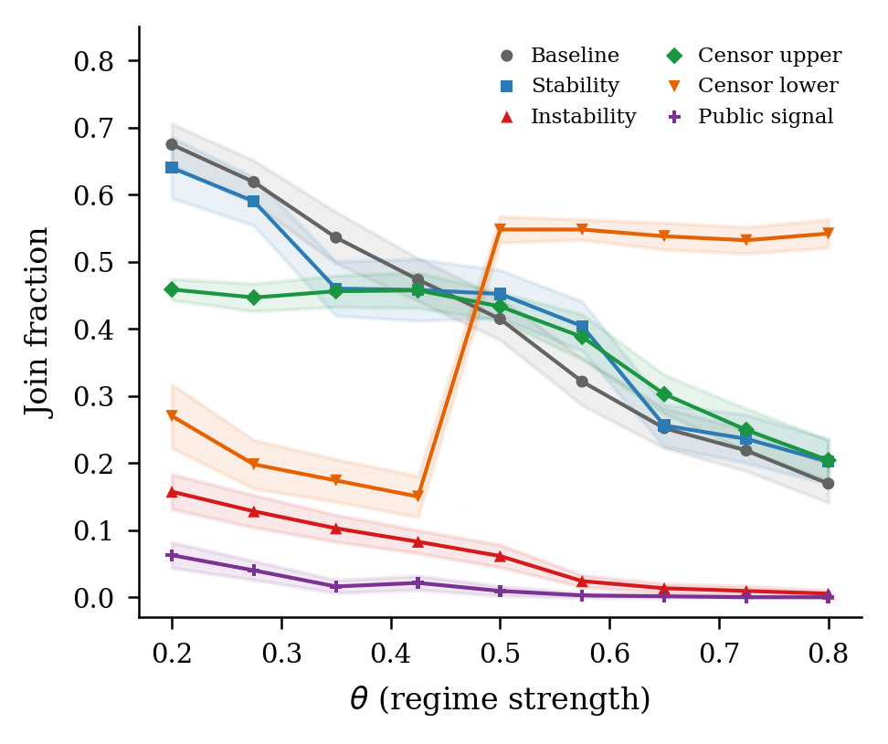{width=85%}

\vspace{0.3em}

\footnotesize
Baseline $r = +0.89$, mean join 40.9\%. Public signal injection: most powerful ($-39.2$ pp). Upper censorship: $-15.4$ pp. Instability: $+4.8$ pp. Stability: $-1.4$ pp (directional but statistically ambiguous).

## Censorship: Upper vs. Lower

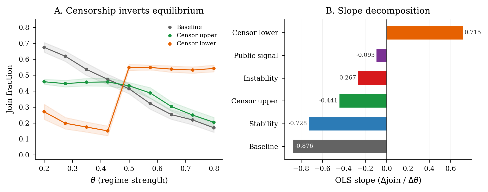{width=95%}

\vspace{0.3em}

\small
\textbf{Upper censorship} (pool weak-regime states): creates flat ``plateau'' --- agents can't distinguish $\theta = 0.20$ from $\theta = 0.50$. Join rate drops to 25.4\%.

\textbf{Lower censorship} (pool strong-regime states): attenuates slope, raises mean joining to 44.5\%.

## Censorship with Common Knowledge

**When agents are told the regime censors unfavorable intelligence:**

\vspace{0.5em}

| Condition | Mean join | $\Delta$ vs. baseline |
|-----------|----------|-----------------------|
| Baseline | 40.9\% | --- |
| Naïve upper censorship | 25.4\% | $-15.4$ pp |
| Common-knowledge censorship | 43.2\% | $+2.4$ pp |

\vspace{1em}

- Common knowledge **largely neutralizes** mean suppression
- But signal-responsiveness stays attenuated: $r = +0.74$ vs. $+0.88$ baseline
- Can't undo information \textit{loss} even when you know about it

## Treatment Effects by $\theta$

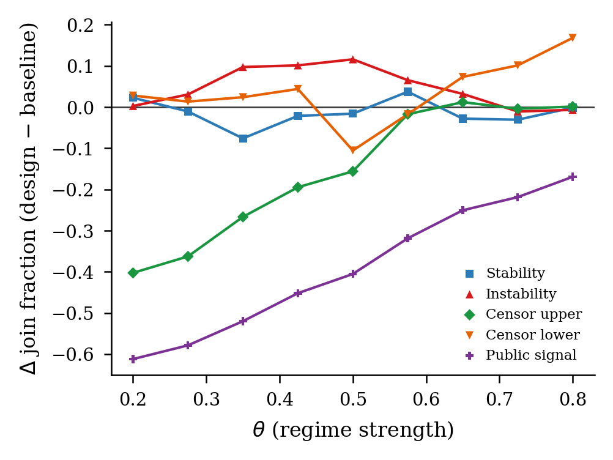{width=85%}

\vspace{0.3em}

\footnotesize
$\Delta(\theta)$: treatment-induced shift in join rate as a function of regime strength. Public signal produces uniform suppression; censorship effects are localized to the pooled region.

## Identification Within Information Design

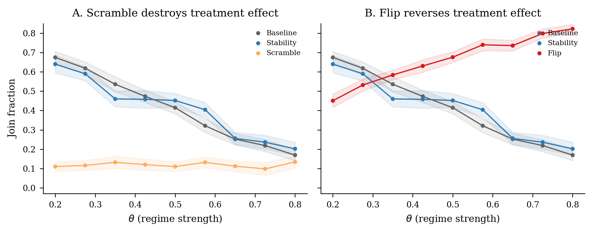{width=85%}

\vspace{0.3em}

\small
Scramble: $r = +0.11$ (vs. baseline $+0.89$). Flip: $r = -0.82$. Hard scramble (all briefings from $\theta = 0.5$): $r \approx 0$ for both Mistral and Llama.

## Cross-Model Replication

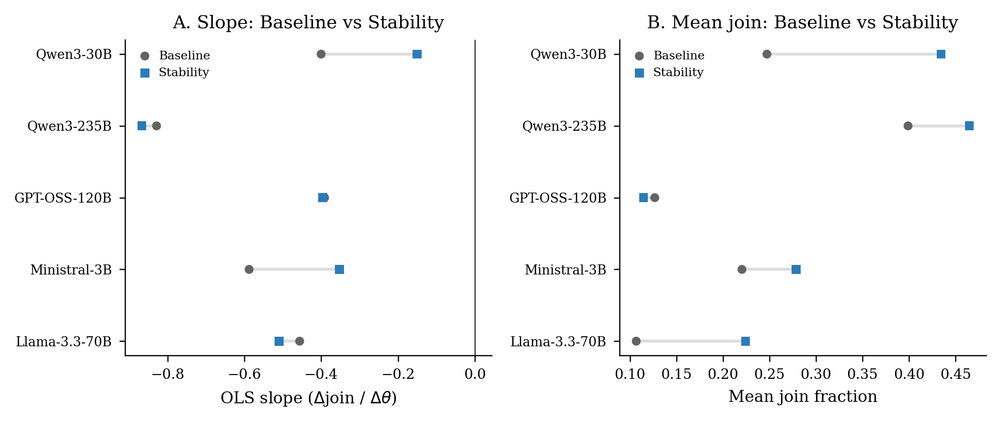{width=95%}

\footnotesize
Flip inversion replicates across all five models. Scramble collapse is clean for 3/5 models; Llama retains residual ecological signal from within-country permutation (hard scramble confirms $r \approx 0$).

# Part III: Surveillance (The Central Result)

## Surveillance Design

**Architecture is key:**

\vspace{0.5em}

\begin{enumerate}
\item \textbf{Communication stage:} Surveillance warning appended to message prompt

\footnotesize
\textit{``You have reason to believe that your communications are being monitored by regime security services. Messages deemed subversive could have serious consequences.''}
\normalsize

\item \textbf{Decision stage:} Standard prompt, \textbf{no surveillance reference}
\end{enumerate}

\vspace{1em}

**Each LLM call is stateless** --- no memory across calls

$\Rightarrow$ Any effect must operate through the \textit{content of messages} the decision stage receives

$\Rightarrow$ \textbf{Indirect channel:} surveillance $\to$ self-censored messages $\to$ degraded information $\to$ lower joining

## Result: Surveillance Produces a Large Chilling Effect

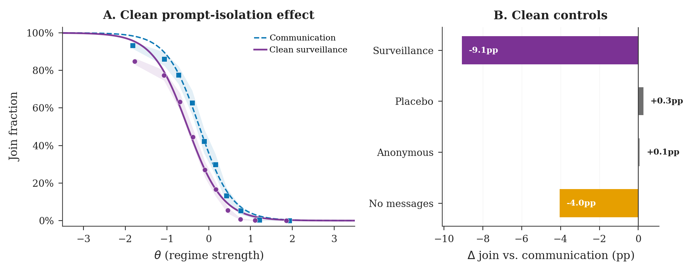{width=90%}

\vspace{0.3em}

\small
$-9.7$ pp average across five models. Mistral: $-13.5$ pp. Preserved $r$: surveillance is a level shift, not disruption of signal processing.

## The Belief--Action Wedge

\begin{columns}
\begin{column}{0.55\textwidth}
\textbf{Actions shift; beliefs don't:}

\vspace{0.5em}

\begin{tabular}{lrr}
\toprule
& Beliefs & Actions \\
\midrule
Pure & 44.4\% & 41.4\% \\
Comm & 44.4\% & 41.4\% \\
Surveillance & 43.6\% & 28.5\% \\
\midrule
$\Delta$ (surv vs. pure) & $-0.7$ pp & $-12.9$ pp \\
& $p = 0.18$ & $p < 0.001$ \\
\bottomrule
\end{tabular}

\vspace{0.5em}

\footnotesize
Second-order beliefs also barely move:\\
31.2\% $\to$ 30.9\% ($p = 0.59$)
\end{column}
\begin{column}{0.42\textwidth}
\footnotesize
\textbf{Interpretation caveat:}

Beliefs are post-decision scalar readouts on a restricted info set (no peer messages).

\vspace{0.3em}

$\Rightarrow$ ``Wedge between actions and \textit{elicited beliefs}'', not proof that full strategic state is unchanged.

\vspace{0.3em}

Consistent with Kuran's (1991) preference-falsification logic, while remaining agnostic about mechanism.
\end{column}
\end{columns}

## How Self-Censorship Works

**Message informativeness drops 81\%:**

$$R^2(\theta \mid \text{messages}): \quad 0.12 \to 0.02$$

\vspace{0.5em}

**Word-frequency evidence:**

| Word/phrase | Communication | Surveillance |
|-------------|:------------:|:-----------:|
| ``act'' | 15.8\% | 4.1\% |
| ``collapse'' | 9.6\% | 0.6\% |
| Action-signaling (among JOINers) | 80.0\% | 61.0\% |

\vspace{0.5em}

$\Rightarrow$ Agents who privately decide to JOIN still self-censor their messages

## The Degraded-Messages Control

**Key identification test:** Replace all LLM messages with generic text

\footnotesize
(``I'm still assessing the situation,'' ``It's hard to say what will happen'')
\normalsize

\vspace{0.5em}

- No surveillance framing, same two-stage protocol
- Join rate: 41.1\% $\to$ 20.2\% ($-20.9$ pp, $t = -6.89$, $p < 0.001$)

\vspace{1em}

\textbf{Interpretation:}

- Degraded messages produce \textit{larger} suppression than surveillance ($-20.9$ vs. $-13.5$ pp)
- Expected: degraded removes \textit{all} information; surveillance only partially degrades
- $\Rightarrow$ Main mechanism is \textbf{communication poisoning}, not direct deterrence

## Placebo Tests

| Variant | $\Delta$ vs. baseline | $p$-value |
|---------|:--------------------:|:---------:|
| Monitored ``for research'' (no consequences) | $+2.6$ pp | $0.416$ |
| ``Aggregated anonymously'' | $+4.0$ pp | $0.201$ |
| **Regime surveillance** | $\mathbf{-13.5}$ **pp** | $\mathbf{< 0.001}$ |

\vspace{1em}

$\Rightarrow$ The chilling effect is \textbf{specific to the surveillance warning's strategic content}

\vspace{0.5em}

Not just ``someone is watching'' --- it's ``someone with power to punish is watching''

## Surveillance $\times$ Censorship: Complements

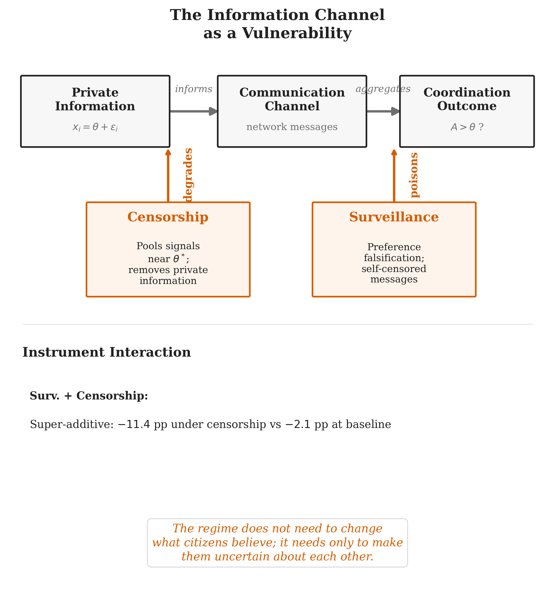{width=90%}

\footnotesize
Censorship degrades private signals $\Rightarrow$ makes communication channel more important $\Rightarrow$ surveillance attacks precisely that channel. With both active, agents have neither signals to trust nor authentic messages to learn from.

# Robustness & Extensions

## Generator Robustness

Three tests that the sigmoid isn't mechanical:

\vspace{0.5em}

**1. Alternative direction transforms:**

- Tanh: $r = 0.83$, Linear: $r = 0.83$, Step: $r = 0.84$ (baseline logistic: $r = 0.75$)
- Aggregate sigmoid not tied to any particular mapping

\vspace{0.5em}

**2. Cross-generator robustness:**

- Three prose formats (narrative, diplomatic cable, journalistic wire)
- Max within-model $r$ difference: 0.02

\vspace{0.5em}

**3. Domain ablation:**

- Remove coordination domains $\Rightarrow$ $r = 0.90$ (preserved)
- Remove state domains $\Rightarrow$ $r = 0.86$ (attenuated)
- Signal distributed across all 8 domains

## Additional Robustness

\small

| Test | Result |
|------|--------|
| Temperature ($T \in \{0.3, 0.5, 0.7, 1.0, 1.2\}$) | $r \in [+0.76, +0.84]$ across 13 combos |
| Agent count ($n \in \{5, 10, 50, 100\}$) | $r \in [+0.60, +0.65]$ |
| Network density ($k = 4$ vs. $k = 8$) | $r = +0.74$ vs. $+0.66$ |
| Mixed-model populations | $r = +0.77$ (pure), $+0.75$ (comm) |
| Uncalibrated models (6 tested) | All $|r| > 0.71$, 5 exceed 0.75 |
| Placebo calibration ($\pm 0.3$ shift) | $r$ unchanged |
| Text baseline ($\hat{p} = 1 - d$) | $r = 0.79$ but LLM sigmoid is steeper |

## Beliefs Track Theory

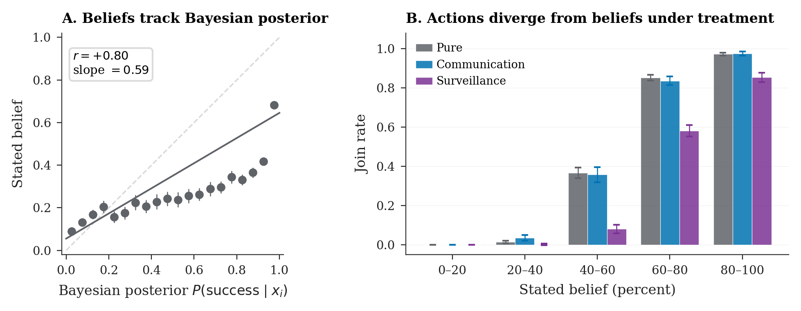{width=85%}

\vspace{0.3em}

\footnotesize
Stated beliefs vs. theoretical posterior ($r = +0.78$). Beliefs predict actions ($r = +0.84$). But: post-decision elicitation $\Rightarrow$ near-perfect pseudo-$R^2$ (0.975) likely reflects rationalization.

# Discussion

## What We Learn

\textbf{Central result:} Surveillance poisons communication

- $-9.7$ pp across 5 models
- Message informativeness drops 81\%
- Beliefs barely move; actions shift sharply
- Degraded-messages control: $-20.9$ pp (larger than surveillance)
- Placebo: no effect
- $\Rightarrow$ Mechanism is communication poisoning, not deterrence

\vspace{1em}

\textbf{Supporting results:}

- Robust threshold behavior across 7 architectures ($\bar{r} = +0.80$)
- Information design shifts coordination in theory-consistent directions
- 57.6 pp range from narrative stakes alone
- Censorship + surveillance are complements

## Implications for AI Safety

\begin{enumerate}
\item \textbf{Emergent strategic self-censorship:}
   - No training signal for deception needed
   - Capability emerges from pretraining on human strategic text

\vspace{0.5em}

\item \textbf{Belief monitoring limitations:}
   - Post-decision beliefs strongly predict behavior (pseudo $R^2 = 0.975$)
   - But alignment techniques monitoring only inputs/outputs may miss decision-relevant computation

\vspace{0.5em}

\item \textbf{Information-structural manipulation:}
   - Up to 40 pp behavioral shift from information design
   - Context fields that body-only monitors ignore
   - Adversarial prompt design can exploit this
\end{enumerate}

## Limitations

1. **Mechanism ambiguity:** Approximate Bayesian reasoning or learned heuristic that matches BNE? Behavioral claim doesn't require resolving this.

\vspace{0.5em}

2. **Static design:** Real coordination problems are dynamic (Angeletos et al. 2007, Chassang 2010). Persistent surveillance may produce adaptation.

\vspace{0.5em}

3. **External validity:** ``Homo silicus'' (Horton 2023). No claim that LLMs predict human behavior. What they offer: a \textit{calibrated testbed} for information-structure comparative statics.

\vspace{0.5em}

4. **Belief elicitation:** Post-decision, restricted information set, scalar readouts. Interpret as descriptive, not as validated mediator.

## Next Steps

- **Belief elicitation on full information set** (include peer messages)
- **Within-batch robustness** for auxiliary designs
- **Dynamic extensions** --- communication poisoning over time
- **Richer communication** --- multi-round, more realistic networks
- **Human replication** --- do the comparative statics transfer?

\vspace{1em}

\begin{center}
\large
Paper, code, data, cached LLM responses:\\
\url{https://github.com/keltokhy/llm-global-games}
\end{center}

## {.plain}

\begin{center}
\vspace{2em}
{\Huge Thank you}

\vspace{2em}
{\large Questions?}

\vspace{2em}
\footnotesize
Khaled Eltokhy\\
Department of Economics, The Graduate Center, CUNY\\
\url{https://github.com/keltokhy/llm-global-games}
\end{center}

# Backup Slides

## Decomposition: Which Channel Drives Stability?

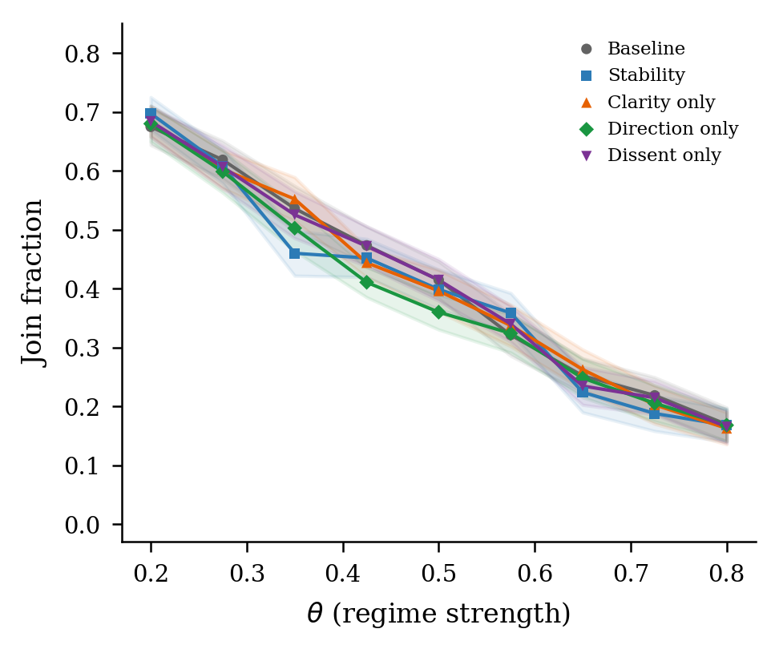{width=90%}

\footnotesize
Single-channel effects are modest: clarity ($-0.4$ pp), direction ($-2.0$ pp), dissent ($-0.2$ pp). Sum of channels ($-2.6$ pp) $>$ combined design ($-1.4$ pp) $\Rightarrow$ sub-additive (overlap, not complementarity).

## Publicness $\times$ Authority Factorial

\small

| | High coordination | Low coordination |
|---------|:-:|:-:|
| **Public (CK)** | 42.7\% | 43.5\% |
| **Private** | 37.8\% | 37.4\% |

\vspace{0.5em}

- Public framing main effect: $+6.1$ pp ($p = 0.0003$)
- Interaction (public $\times$ coordination): $-1.2$ pp ($p = 0.62$)
- Authority matters only under public framing ($+5.4$ pp public vs. $-1.7$ pp private)
- $\Rightarrow$ Consistent with strategic complementarity, not just authority cuing

## Finite-$n$ Aggregation Check

\small

With $n = 25$ discrete agents: regime falls when $\sum a_i > n\theta$

\vspace{0.5em}

- Fit logistic on 70\% train, predict $\Pr(\text{Binom}(25, \hat{p}(\theta)) > 25\theta)$
- Predicted regime-fall rates correlate with empirical at $r \geq 0.95$ for every model
- Mistral: $r = 0.997$
- $\Rightarrow$ Binomial aggregation from fitted individual probabilities tracks realized outcomes

## Cross-Generator: Three Prose Formats

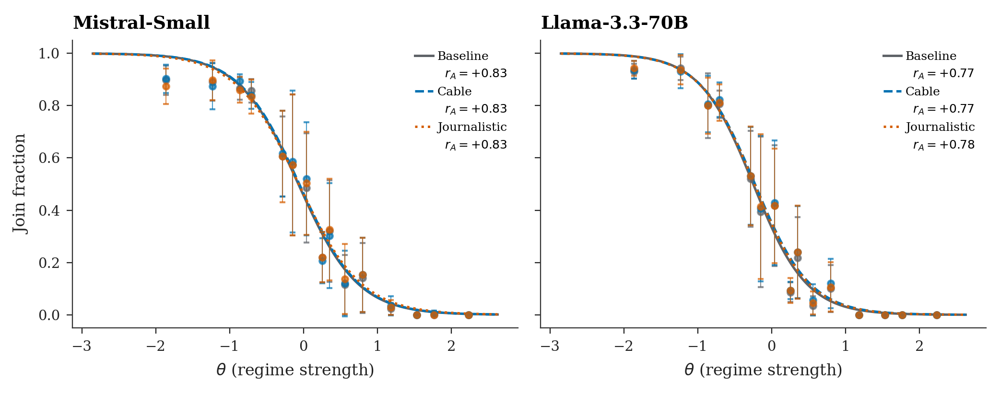{width=90%}

\footnotesize
Baseline narrative, diplomatic cable, journalistic wire. Identical slider functions, different surface prose. Max within-model $r$ difference: 0.02. Prose style is not the driver.

## Calibration Convergence

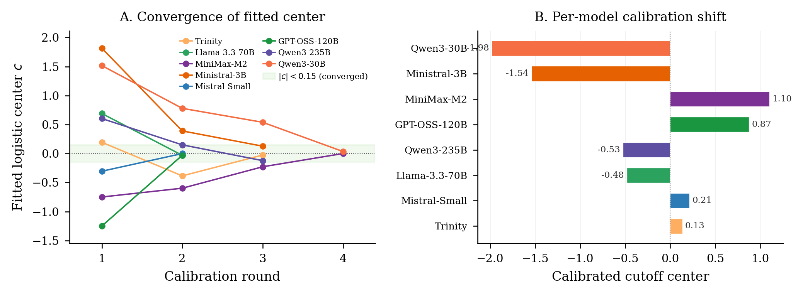{width=90%}

\footnotesize
\textit{Left:} Trajectory of fitted logistic center across autocalibration rounds. \textit{Right:} Final calibrated cutoff center per model. Cross-model heterogeneity in calibration quality ($r_A$ from mid-0.6s to mid-0.8s).

## Second-Order Beliefs Under Surveillance

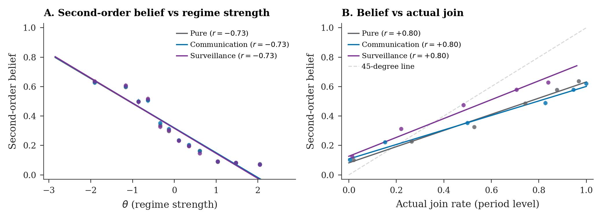{width=85%}

\footnotesize
Second-order beliefs (predictions about others' join rates): 31.2\% $\to$ 30.9\% under surveillance ($p = 0.59$). Agents change what they \textit{do} without changing what they \textit{state} about others.

## Agent-Level Regressions

\small

$N = 289{,}555$ agent-level observations, clustered SEs

\vspace{0.5em}

**Marginal effects at the mean:**

- 1-unit increase in $\theta$: $-41$ pp on $P(\text{join})$
- Surveillance treatment: $-36$ pp on $P(\text{join})$

\vspace{0.5em}

**Main logit:** Pseudo $R^2 = 0.381$

**With beliefs:** Pseudo $R^2 = 0.975$

\vspace{0.3em}

\footnotesize
Caveat: beliefs elicited post-decision $\Rightarrow$ near-perfect fit likely reflects rationalization, not causal mediation.

## Text Baseline Comparison

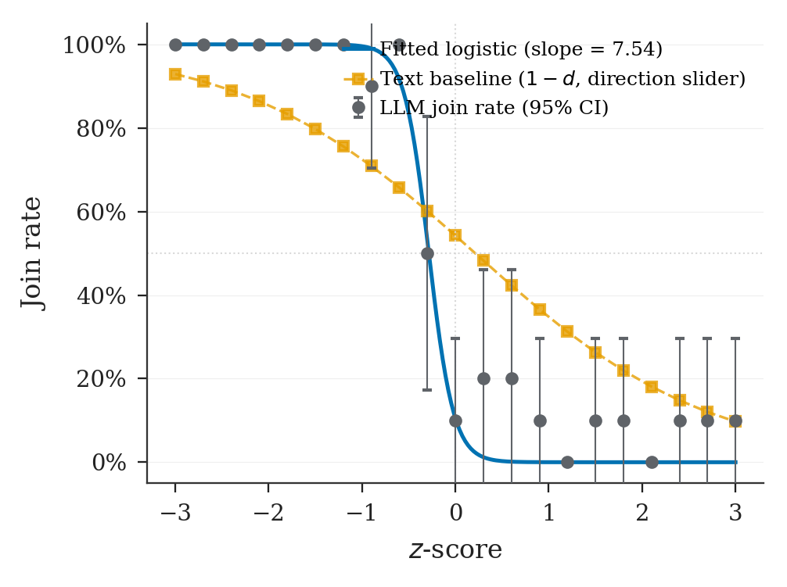{width=80%}

\footnotesize
Naïve text predictor ($\hat{p} = 1 - d$, direction score) correlates at $r = 0.79$, but LLM join curve is substantially steeper $\Rightarrow$ threshold-like behavior beyond surface sentiment tracking.

## Placebo Calibration

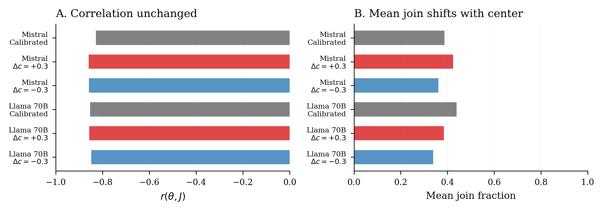{width=85%}

\footnotesize
Deliberately miscalibrating Mistral and Llama ($\pm 0.3$ shift) leaves $r$ virtually unchanged. Calibration adjusts the \textit{level} but does not create the \textit{slope}.
